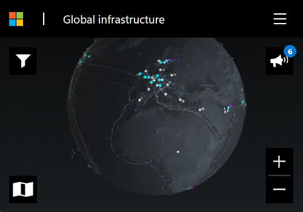
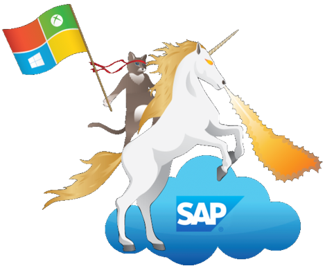

# How to get started with SAP and Microsoft integration scenarios

>🚀QUICK link to community [blog gallery](https://martinpankraz.github.io/ninja-unicorn/)

This repository contains everything you need to get started with joint Microsoft + SAP scenarios. The repos content complements the SAP community posts, our SAP+Microsoft YouTube Channel and webcasts as well as the open-source contributions on GitHub made by an amazing group of contributors!

For your weekly news from the SAP+Microsoft world follow the mentioned [YouTube channels](https://github.com/MartinPankraz/ninja-unicorn#-youtube-channels).

To get a first impression about the limitless opportunities of extending SAP applications with Microsoft and Azure services, this Azure Friday episode is a perfect starting point:

## 🤝 The partnership between both companies dates back many decades

The Azure Friday session above gave you a glimpse into the world of combining SAP and Microsoft.  We are looking back at 25+ years of partnership between both companies which is the foundation to support common goals long term. See below what is current top of mind in that area.

| Description | Source |
| ----------- | ----------- |
| Press release which covers the [joint commitment by the companies](https://news.sap.com/2019/10/sap-microsoft-partnership-cloud-migration-offerings/) to simplify and streamline customers’ journeys to the cloud | [SAP and Microsoft Partnership Expands - SAP News Center](https://news.sap.com/2021/01/sap-and-microsoft-expand-partnership-integrate-teams/) |
| Overview about Microsoft and SAP partnering to meet the needs of every business | [Come Explore the Future (sap.com)](https://www.sap.com/dmc/exp/2020-09-sap-microsoft-immersive-experience/index.html#/) |
| How SAP and Microsoft are working together to accelerate customer innovation and transformation | [Collaborating for Success: How SAP and Microsoft are working together to accelerate customer innovation and transformation](https://www.sap.com/documents/2021/01/ca0f4c25-c87d-0010-87a3-c30de2ffd8ff.html) |

## 🧱 Overview of the technical foundation

You want to learn more about the basics of the technical foundation behind SAP and Azure?

**Level 1️⃣ - Let's start with an overview of [Azure's Global Infrastructure (microsoft.com)](https://infrastructuremap.microsoft.com/).**

🧑‍🚀Challenge: Can you spot the satellite 🛰️ on the screenshot? Microsoft services capabilities extended by [space infrastructure](https://azure.microsoft.com/solutions/space).

  

**Level 2️⃣ - Let's get an overview what services are available on Azure by taking a look at the [Azure Services Overview (azurecharts.com)](https://azurecharts.com/overview).**

**Level 3️⃣ - Now let's dive a bit more into the combination of SAP and Microsoft namely the [SAP solutions on Azure | Microsoft Azure](https://azure.microsoft.com/solutions/sap/azure-solutions/#solution-architectures).**

**Level 4️⃣ - You want more? We have you covered by two more valuable resources:**

The [SAP Discovery Center – BTP Services on Azure (cloud.sap)](https://discovery-center.cloud.sap/viewServices?provider=azure&regions=all&showFilters=true)

and [SAP’s library of joint use cases (discover.sap.com)](https://discover.sap.com/microsoft/en-us/azure.html#use-cases)

## 👩‍💻 Get started for free with developer accounts

Now you have seen enough and want to make your hands dirty? Good news, you can dive-in headfirst without worrying about cost and hit the ground running with awesome open-source projects. All required components offer a free tier. Credit card details are only required to prohibit trial misuse. They won’t be charged till you actively switch or convert your subscription to a paid one.

| Description | Account |
| ----------- | ----------- |
| **Azure Free Trial**, useful in the context of configuring Azure AD for development purposes | [Azure Free Trial](https://azure.microsoft.com/free/) |
| **SAP BTP on Azure Trial Account**, select Singapore for Azure | [BTP (🚀 on Azure 🚀) Trial Account](https://developers.sap.com/tutorials/hcp-create-trial-account.html) |
| **M365** Developer Program | [Developer Program \| Microsoft 365 Dev Center](https://developer.microsoft.com/microsoft-365/dev-program) |
| Public **GitHub** account to host your projects | [GitHub account](https://github.com/) |

## 💪 Enablement and SAP Discovery Center Missions

✅ You are all set to get start coding. Here are some resources that give you a decent start into the world of SAP and Microsoft.

| Description | Source |
| ----------- | ----------- |
| The perfect start and a **must-see** | [Building Applications on SAP BTP with Microsoft Services \| openSAP](https://open.sap.com/courses/btpma1) |
| SAP Discovery Center Missions providing use-cases for combing BTP and Microsoft Azure services | [Integrate Azure Data Explorer and SAP Data Warehouse Cloud](https://discovery-center.cloud.sap/missiondetail/3433/3473/)  [Establish security workflow between SAP and Microsoft apps (cloud.sap)](https://discovery-center.cloud.sap/missiondetail/3232/3236/)  [Extend your business workflow with Microsoft Teams & Outlook (cloud.sap)](https://discovery-center.cloud.sap/missiondetail/3674/3717/)  [Route traffic between SAP Cloud Integration tenants with Azure](https://discovery-center.cloud.sap/missiondetail/3603/3646/) |

> 📝 Tip - [openSAP courses](https://open.sap.com/) guide you through the journey with lectures and assignments to foster learning whereas Discovery Center Missions focus more on the correct deployment of a solution.

## 🧑‍🤝‍🧑 Meet the community

We contribute to the tech communities through actionable prototypes, blogs, Q&A marathons, and controversial discussions. Find below some of our influential voices and user groups out there. We featured their latest trending blogs, webcasts and feeds.

### 📺 YouTube Channels

YouTube is of course one source for collecting information. There are two formats we highly recommend:

* Famous unofficial [SAP + Microsoft YouTube Channel](https://www.youtube.com/c/SAPonAzure) hosted by [Holger Bruchelt](https://people.sap.com/hobruche).

Latest edition:

<!-- YOUTUBESOA:START --><table><tr><td></td></tr><tr>
<td><a href="https://www.youtube.com/watch?v=cLUv3IKZR-s">#122 - The one with Ransomware and Back to Business &lpar;Sebastian Ullrich &amp; Martin Steiner&rpar; | SAP Azure</a></td></tr></table><!-- YOUTUBESOA:END -->

* Equally interesting webcast called “[myNewsWrap](https://www.youtube.com/playlist?list=PLmZLSvJAm8Fb3S4T9JWgwm0klLI8uc-ka)” on SAP + Microsoft from a developer perspective hosted by [Christian Lechner](https://people.sap.com/christian.lechner).

Latest edition:

<!-- YOUTUBEMNW:START --><table><tr><td></td></tr><tr>
<td><a href="https://www.youtube.com/watch?v=9jXC_AjrcaU">#QuickGlance - Azure Developer CLI - September Update</a></td></tr></table><!-- YOUTUBEMNW:END -->

### 💬 LinkedIn

LinkedIn is another source we like to bring to your attention namely the insightful LinkedIn group  owned by [Denys van Kempen](https://people.sap.com/denys.kempen).

### 📰 Blog Posts

Find our searchable blog post gallery grouped by topic [here](https://martinpankraz.github.io/ninja-unicorn/).

## 📢 Customer Engagement Initiatives (CEI) and public BETAs

Equally important for your future endeavour with SAP and Microsoft are Customer Engagement Initiatives (CEI) and BETA programs:

* [Inviting you: Register soon to explore your event-driven pathway between SAP and Microsoft Azure | SAP Blogs](https://blogs.sap.com/2021/10/08/inviting-you-register-soon-to-explore-your-event-driven-pathway-between-sap-and-microsoft-azure/)
* [SAP Private Link Service GA announcement after public Beta | SAP Blogs](https://blogs.sap.com/2022/06/22/sap-private-link-service-on-azure-is-now-generally-available-ga)
* [SAP Private Link service CEI - Jul 22 | SAP Customer Influence](https://influence.sap.com/sap/ino/#campaign/3118)
* [SAP Early Adopter Care | SAP S/4HANA Cloud - MS Teams Integration](https://influence.sap.com/sap/ino/#campaign/3051)

## 🦸 Meet the community members

Last but not least, here we go with a list of contributors (in alphabetical order of first name)

| The face behind the ninja cat 🥷🐱 | Coordinates |
|---: | :--- |
| </img>           | **Bartosz Jarkowski**     [SAP Community](https://people.sap.com/bjarkowski) |
| </img> | **Christian Lechner**         [SAP Community](https://people.sap.com/christian.lechner) |
| </img>             | **Harutyun Ter-Minasyan**       |
| </img>            | **Holger Bruchelt**      [SAP Community](https://people.sap.com/hobruche) |
| </img>            | **Martin Pankraz**      [SAP Community](https://people.sap.com/martin-pankraz) |
| </img>    | **Martin Raepple**    [SAP Community](https://people.sap.com/mraepple) |
| </img>               | **Maximilian Streifeneder**      [SAP Community](https://people.sap.com/iinside) |
| </img>             | **Roman Broich**      [SAP Community](https://people.sap.com/roman_broich_msft) |
| </img>           | **Thijs Zandvliet**      |
| </img>           | **Bart Delanghe**      [SAP Community](https://people.sap.com/badelang) |
| </img>           | **Robert Biro**      [SAP Community](https://people.sap.com/bobbiromsft) |
| </img>           | **William Eastbury**      |

## 🙋 Contributing

One more thing: we are always looking for passionate SAP + Microsoft advocates. Just reach out via GitHub, create pull-requests, post issues, meet us at the SAP community, LinkedIn or Twitter.

Yours

Integration [Ninja Cats](https://martinpankraz.github.io/ninja-unicorn/about/) 🥷🐱

