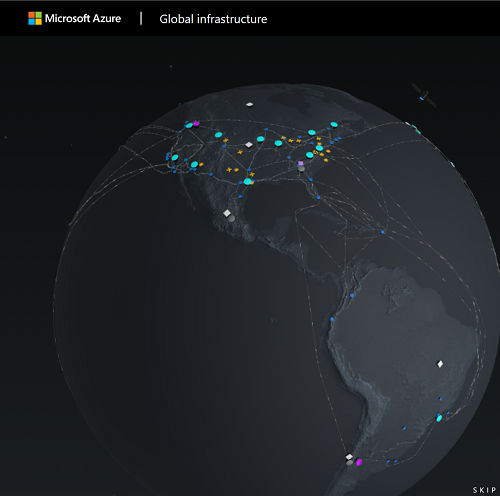

# How to get started with SAP and Microsoft integration scenarios

This repository contains everything you need to learn about Microsoft + SAP joint scenarios and complements the SAP community posts, SAP+Microsoft YouTube Channel, webcasts and open-source contributions on GitHub made by an amazing group of contributors!

Furthermore, you will learn about the latest community efforts, BETAs and announcements.

To get a first impression about the limitless opportunities of extending SAP applications with Microsoft and Azure services, this Azure Friday episode is a perfect starting point:

## The partnership between both companies dates back many decades

The Azure Friday session above gave you a glimpse into the world of combining SAP and Microsoft.  We are looking back at 25+ years of partnership between both companies which is the foundation to support common goals long term. See below what is current top of mind in that area.

| Description | Source |
| ----------- | ----------- |
| Press release which covers the [joint commitment by the companies](https://news.sap.com/2019/10/sap-microsoft-partnership-cloud-migration-offerings/) to simplify and streamline customers’ journeys to the cloud | [SAP and Microsoft Partnership Expands - SAP News Center](https://news.sap.com/2021/01/sap-and-microsoft-expand-partnership-integrate-teams/) |
| Overview about Microsoft and SAP partnering to meet the needs of every business | [Come Explore the Future (sap.com)](https://www.sap.com/dmc/exp/2020-09-sap-microsoft-immersive-experience/index.html#/) |
| How SAP and Microsoft are working together to accelerate customer innovation and transformation | [Collaborating for Success: How SAP and Microsoft are working together to accelerate customer innovation and transformation](https://www.sap.com/documents/2021/01/ca0f4c25-c87d-0010-87a3-c30de2ffd8ff.html) |

## Overview of the technical foundation

[Azure Global Infrastructure (microsoft.com)](https://infrastructuremap.microsoft.com/) and [SAP solutions on Azure | Microsoft Azure](https://azure.microsoft.com/solutions/sap/azure-solutions/#solution-architectures)

[Azure Services Overview (azurecharts.com)](https://azurecharts.com/overview)

[SAP Discovery Center – BTP Services on Azure (cloud.sap)](https://discovery-center.cloud.sap/viewServices?provider=azure&regions=all&showFilters=true)

[Explore SAP’s library of joint use cases (discover.sap.com)](https://discover.sap.com/microsoft/en-us/azure.html#use-cases)

## Get started for free with developer accounts

Good news, you can dive-in headfirst without worrying about cost and hit the ground running with awesome open-source projects. All required components offer a free tier. Credit card details are only required to prohibit trial misuse. They won’t be charged till you actively switch or convert your subscription to a paid one.

| Description | Account |
| ----------- | ----------- |
| **Azure Free Trial**, useful in the context of configuring Azure AD for development purposes | [Azure Free Trial](https://azure.microsoft.com/free/) |
| **SAP BTP on Azure Trial Account**, select Singapore for Azure | [BTP (🚀 on Azure 🚀) Trial Account](https://developers.sap.com/tutorials/hcp-create-trial-account.html) |
| **M365** Developer Program | [Developer Program | Microsoft 365 Dev Center](https://developer.microsoft.com/microsoft-365/dev-program) |
| Public **GitHub** account to host your projects | [GitHub account](https://github.com/) |

## Enablement and SAP Discovery Center Missions

Now you are all set to get your hands dirty.

| Description | Source |
| ----------- | ----------- |
| The perfect start and a **must-see** | [Building Applications on SAP BTP with Microsoft Services | openSAP](https://open.sap.com/courses/btpma1) |
| SAP Discovery Center Missions providing use-cases for combing BTP and Microsoft Azure services | [Integrate Azure Data Explorer and SAP Data Warehouse Cloud](https://discovery-center.cloud.sap/missiondetail/3433/3473/)  [Establish security workflow between SAP and Microsoft apps (cloud.sap)](https://discovery-center.cloud.sap/missiondetail/3232/3236/)  [Extend your business workflow with Microsoft Teams & Outlook (cloud.sap)](https://discovery-center.cloud.sap/missiondetail/3674/3717/) |

OpenSAP courses guide you through the journey with lectures and assignments to foster learning whereas Discovery Center Missions focus more on the correct deployment of a solution.

## Meet the community

We contribute to the tech communities through actionable prototypes, blogs, Q&A marathons, and controversial discussions. Find below some of our influential voices and user groups out there. We featured their latest trending blogs, webcasts and feeds.

Famous unofficial [SAP + Microsoft YouTube Channel](https://www.youtube.com/c/SAPonAzure) hosted by [Holger Bruchelt](https://people.sap.com/hobruche).

Equally interesting webcast called “[myNewsWrap](https://www.youtube.com/playlist?list=PLmZLSvJAm8Fb3S4T9JWgwm0klLI8uc-ka)” on SAP + Microsoft from a developer perspective hosted by [Christian Lechner](https://people.sap.com/christian.lechner).

Insightful LinkedIn group “[SAP Architects on Azure](https://www.linkedin.com/groups/9055223/)” owned by [Denys van Kempen](https://people.sap.com/denys.kempen).

### From left to right and top to bottom

[Martin Raepple](https://people.sap.com/mraepple), [Bartosz Jarkowski](https://people.sap.com/bjarkowski), [Harutyun Ter-Minasyan](https://www.linkedin.com/in/hterminasyan/), [Maximilian Streifeneder](https://people.sap.com/iinside), [Holger Bruchelt](https://people.sap.com/hobruche), [Roman Broich](https://www.linkedin.com/in/roman-broich/), [Christian Lechner](https://people.sap.com/christian.lechner) and [Martin Pankraz](https://people.sap.com/martin-pankraz)

</img> </img> </img> </img> </img> </img> </img> </img>

Find our blog post rooster grouped by topic [here](rooster/blog-rooster.md).

## Customer Engagement Initiatives and public BETAs

[Inviting you: Register soon to explore your event-driven pathway between SAP and Microsoft Azure | SAP Blogs](https://blogs.sap.com/2021/10/08/inviting-you-register-soon-to-explore-your-event-driven-pathway-between-sap-and-microsoft-azure/)

[SAP Private Link Service (BETA) is Available | SAP Blogs](https://blogs.sap.com/2021/06/28/sap-private-link-service-beta-is-available/)

## Contributing

We are always looking for passionate SAP + Microsoft advocates. Just reach out via GitHub, create pull-requests, post issues, meet us at the SAP community, LinkedIn or Twitter.

Yours

